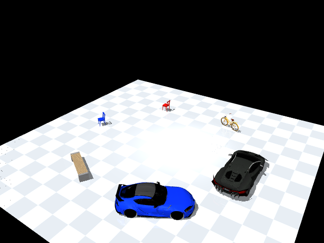
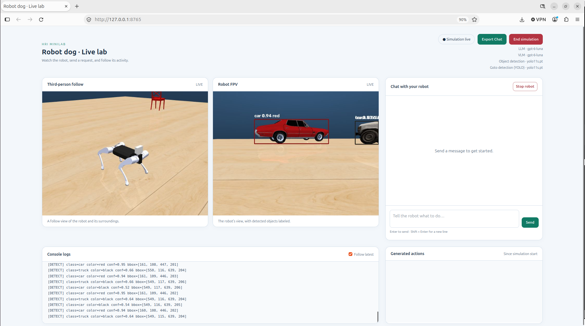

# EE5112 Minilab 1.3 Commanding Quadruped Robot Dog with LLM + YOLO
> Course: EE5112 Human Robot Interaction  
> Group: 2  
> Members: Loh Xin Zhi, Lee Dosang, Brian Seah Yee Chuen

## Minilab Description
The minilab requires the group to implement the control of the quadruped robot dog using type English command. The robot dog is then expected to execute the command, using a pre-trained reinforcement-learnign policy. A camera is mounted on the robot dog and a YOLO object detector detects the objects in the scene. 

The current implementation only uses LLM/VLM cloud services from OpenAI. YOLO detection is done locally and model weights will be installed locally.

### Custom Map Scene
The minilab is done ina Mujoco simulator. A [custom map scene](map/coco_scene.xml) is create for the demo:



The scene consist of:
1. Red sedan car
2. Gray SUV car
3. Brown bicycle
4. Red chair
5. Blue chair
6. Green bench

### Task distribution
| Task | Description |Contributors |
| --- | --- | --- |
| 1 | LLM for Robot Control and Learned Legged Locomotion | All |
| 2 | Platform Setup, Scene Building and Motion Skills | Brian Seah Yee Chuen |
| 3 | English Motion Command via LLM Parser | Lee Dosang |
| 4 | YOLO Object Search and Approach | Loh Xin Zhi |
| 5 | Task Integration, Videos and Report Submission  | All |

### Bonus Features
1. Added `describe` action to perform scene description as seen by the robot live feed or visual question answering (**VQA**) if a questionis asked.
2. Added a browser graphic user interface (**GUI**) to interface with the chat, console log and the robot camera feed.
3. All the LLM to parse input prompt into multi-goal missions, executing the actions in sequence.
4. Added option to perform `goto_object` action using **VLM**. Performance is compared with YOLO method in the report

## Quick Start 

### Required packages and tools

The implemented code is developed and tested using the packages/tools, with their verison number below. A conda environment is used to manage the Python packages, with the require package in [environment.yml](environment.yml).

| Package/tool | Reference version | Purpose |
| --- | --- | --- |
| Python | 3.11.16 | Application runtime |
| Conda | 26.5.3 | Isolated environment; Miniconda or Anaconda |
| pip | 26.1.2 | Python package installation |
| setuptools | 83.0.0 | Building/installing the runtime package |
| mujoco | 3.14.0 | Physics and camera rendering |
| mujoco-runtime-control | 0.6.0 | `runtime_control`, installed from `quadruped_mujoco` |
| numpy | 2.4.6 | Numerical operations |
| onnxruntime | 1.30.0 | Robot locomotion policy inference |
| PyYAML | 6.0.3 | Reading `dog.yaml` |
| ultralytics | 8.4.166 | COCO-pretrained YOLOv8 detector |
| torch | 2.14.0 | YOLO inference backend |
| torchvision | 0.29.0 | PyTorch vision utilities |
| opencv-python | 5.0.0.93 | Camera frames, annotations and JPEG encoding |
| matplotlib | 3.11.2 | Saved heading/angular-velocity plots |
| Pillow | 12.3.0 | Image utilities used by the runtime package |
| glfw | 2.10.2 | MuJoCo's default rendering backend |
| openai | 3.22.1 | Cloud LLM client |

### 1. Download the application and runtime

Create a project workspace and clone require git repository. Run:

```bash
mkdir -p workspace/src
cd workspace/src
git clone https://github.com/lohxinzhi/hri_minilab.git
git clone https://github.com/aoqianz/quadruped_mujoco.git
```

Keep the application assets in their existing relative locations:

```text
workspace/src/
├── quadruped_mujoco/          # Provides the installed runtime_control package
└── hri_minilab/
    ├── play.py
    ├── environment.yml      # Conda environment and Python dependencies
    ├── dog.yaml
    ├── model_3400.onnx       # Pretrained locomotion policy
    ├── yolov8n.pt            # COCO-pretrained detector
    ├── dog/                 # Robot MJCF and meshes
    ├── map/                 # Scene XML and meshes
    └── web/index.html       # GUI Dashboard
```

The robot model, ONNX policy, YOLO weights and scene assets are included in the
application repository. There is no need to download the original vehicle GLBs
or install mesh-conversion tools. See [map/README.md](map/README.md) for asset
sources and attribution. If `yolov8n.pt` is missing, Ultralytics downloads it on
first use, which requires internet access.

### 2. Create the Python environment

From `workspace/src`, enter the application directory before creating the environment:

```bash
cd hri_minilab
conda env create -f environment.yml
conda activate quad_mujoco
python -m pip check
```

The file installs Python, pip, the pinned application packages, and the sibling
`quadruped_mujoco` checkout in editable mode. Run these commands from
`hri_minilab` so the `../quadruped_mujoco` dependency resolves correctly.
If the environment already exists, update it from the same file:

```bash
conda env update -n quad_mujoco -f environment.yml
```

Use the [official PyTorch installation selector](https://pytorch.org/get-started/locally/)
if your platform needs a CPU-specific or CUDA-specific wheel index. Keep the
`torch`/`torchvision` versions paired. This project uses CPU ONNX Runtime;
`onnxruntime-gpu` and a CUDA toolkit are not required for the locomotion policy.
Do not install `opencv-python-headless` alongside `opencv-python` because both
provide the same `cv2` module.

### 3. Launching simulation and demo

To use OpenAI LLM services, you need an OpenAI API Key. Export your API into the OS environment before launching the demo.

From a new terminal, the simulation can launch the the following commands:

```bash
export OPENAI_API_KEY="<your_openai_api_key>"
conda activate quad_mujoco
cd workspace/src/hri_minilab
python play.py --map coco_scene --gui
```


The GUI dashboard opens automatically at `http://127.0.0.1:8765`. Open that URL
manually if automatic browser launch is unavailable. Use `--gui-port 8766` for
a different port. The server listens only on the local machine.

The detector defaults to YOLOv8 nano (`yolov8n.pt`). Select another YOLO model
or a custom weights path with `--vision-model`:

```bash
python play.py --map coco_scene --gui --vision-model yolov8s.pt
python play.py --map coco_scene --gui --vision-model /path/to/custom_weights.pt
```

Describe/VQA uses a separate OpenAI VLM, defaulting to `gpt-6-luna`.
Use `--vlm-model` to select a model available to your account that supports
image input and Chat Completions. See the [official OpenAI vision guide](https://developers.openai.com/api/docs/guides/images-vision).

```bash
python play.py --map coco_scene --gui --vision-model yolo11n.pt --vlm-model gpt-6-luna
```

Goto search/approach uses YOLO bounding boxes by default. Add `--use-vlm`
to use the configured `--vlm-model` instead:

```bash
python play.py --map coco_scene --gui --use-vlm --vlm-model gpt-6-luna
```

## Using the GUI dashboard



The page shows the configured LLM, VLM, and object detection models and contains:

- The existing third-person follow view and robot FPV.
- Labeled bounding boxes in the FPV.
- A messaging panel showing user requests, queued/thinking status, robot response. Enter sends a message; Shift + Enter adds a line.
- A bottom console panel streaming console/terminal logs. 
- A generated-actions panel, showing every JSON actions generated from the LLM prompt. The currently executing action is highlighted
- An **Export Chat** button downloads chat history and generated plans. Export before ending the simulation.
- A top-right **End simulation** button that exits the simulation.
- A **Stop robot** button that cancels the current motion and remaining actions.

Send requests in the chat panel, for example:

- `Move forward at 0.5 m/s for 2 seconds, then turn left 90 degrees.`
- `Turn right 45 degrees, then walk backward for one second.`
- `Stop.`

The API uses [OpenAI Structured Outputs](https://developers.openai.com/api/docs/guides/structured-outputs)
with a strict action schema and local validation before execution.

## License

The project code is licensed under the [Apache License 2.0](LICENSE).
Third-party code, pretrained model weights and object meshes retain their
respective licenses; this license does not replace those terms. Map asset
attributions and licenses are listed in [map/ASSET_SOURCES.md](map/ASSET_SOURCES.md).
The `quadruped_mujoco` repository is a separate dependency with its own terms.
